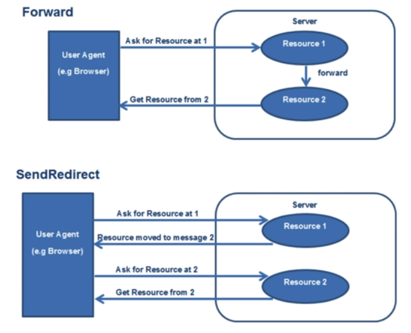

# Spring 프레임워크 간단 구현 연습

## 목표
- DispatcherServlet 구조 및 Reflection 라이브러리 사용법 숙지]

## 노트
- [ ] Forward vs Redirect
    + Forward - 클라이언트가 아닌 다른 서블릿(JSP)에게 요청
    + Redirect - 클라이언트를 다시 거쳐 다른 서블릿에게 요청
    
  
- [ ] Front Controller pattern
    + 모든 요청을 단일 handler에서 처리하도록 하는 패턴
    + Spring Mvc의 DispatcherServlet이 예시

- [ ] 